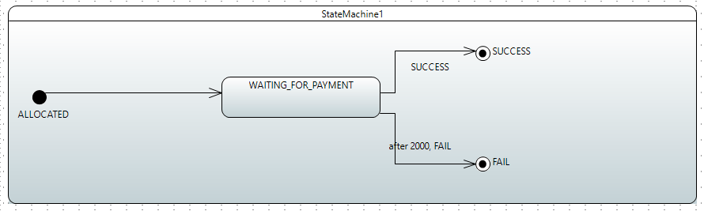

This repository is POC work about Spring State Machine. Some projects use BPMN, but is it really needed?Because BPMN is
complex and difficult to implement. Spring state machine can be used for lower level needs. I made an example of the
spring state machine that fully meets my needs. In fact, you can configure the spring state machine directly from the
configuration files as well as you can do it with the UML files you prepared
with `[Eclipse Papyrus](https://www.eclipse.org/papyrus/). We will have used Eclipse Papyrus on this work. In summary,
we will base a simple payment system. This process will basicly consist three phases.

1. Products will be allocated from the stock as much as the entered quantity.
2. Wait for payment for items allocated from stock.
3. Result (Success or Fail)
    1. If the result fail, stock will be returned.
        1. If the payment could not be happen during 10 seconds. Stock will be returned.
        2. If the payment could fail, stock will be returned.
    2. If the result success, it will be deducted from the stock as much as the entered quantity.

According to this process, UML diagram should be below,

If you use `@EnableStateMachine`, spring will generate one instance for you, but we need is multiple instances. So, we
will use `@EnableStateMachineFactory`. In addition to we use JPA for persisting states. You need to add the dependencies
that we need to accomplish all this as well.

You can test project with endpoints that be exposed via RestController.

You can also reach all detail of Spring State Machine with
this [link](https://docs.spring.io/spring-statemachine/docs/2.2.3.RELEASE/reference/#preface)

# You can use BPMN

* If you have very complex business processes.
* If you need to assignment of tasks
* If you need a process versioning.

# You do not need BPMN

* If you have a low level processes.
* If you do not need to manage a versioning of the processes.
* If you do not have enough resources to deploy the BPMN.
